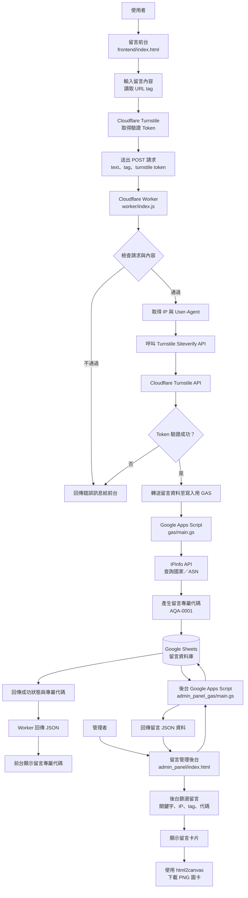

# 自製的匿名問答系統（基於 Cloudflare Worker 和 Google Sheet 這些免費服務，可零成本架設）

## 專案簡介


這是一款完全開源且可自主架設的匿名問答系統，旨在成為Instagram或其他社交平台上，常出現的匿名問答服務的替代方案。

讓你擺脫第三方平台對資料的掌控與隱私疑慮，利用 Cloudflare Worker 與 Google Sheets 打造無伺服器架構——不僅資料 100% 由自己掌控，還整合了 Cloudflare Turnstile 防刷驗證與 IP/裝置紀錄，提供更安全、免費且高度自主的匿名留言體驗。

## 特色與功能

- 完全無須架設自己的伺服器
- Cloudflare Turnstile 驗證防機器人
- 收集 IP、User-Agent並透過 ipinfo.io API 解析IP所在地
- 帶有留言查看面板（後台），可以直接查看留言並生成留言圖片，貼上 Instagram 限時動態（舉例）
- 留言資料自己掌控
- 每一則留言會產生一個辨識碼，方便粉絲辨識自己的留言
- 可以在前端網頁的URL後面加上`?tag=`標籤參數，方便辨識留言的來源
- 本專案使用 [MIT License](LICENSE)，你完全可以自己修改程式碼

## 如何讓別人透過這個系統發送留言？

和一般的匿名問答系統一樣，直接將匿名問答系統網頁的網址傳送給粉絲、朋友即可。

你也可以在網址後面加上`?tag=吧拉吧拉`參數，這個Tag的值會一併記錄到使用者發送的留言中，並且只有資料庫持有者（你）會知道，可以用來分流、辨識留言來源。

系統會配發給發送留言者一個獨一無二的流水號（例如：`AQA_9487`），這組流水號也會記錄到使用者發送的留言中，並且會顯示在留言面板（後台）網頁中生成的留言卡片顯示，這樣一來就可以讓發送留言者在你的Instagram限動上（舉例而已）辨識自己發送的留言。


### 你（留言資料庫持有者）如何查看留言查看面板（後台）

我也有設計一個**留言查看面板（也可以稱後台）**，它會透過Google Apps Script讀取Google Sheet，然後網頁去讀取Apps Script，渲染成圖卡，可以方便查看留言，甚至一鍵生成留言圖卡，然後貼到Instagram上傳（舉例）。


詳情請看[留言查看面板(簡稱後台)架設教學](#留言查看面板簡稱後台架設教學)

## 發送留言的系統架設教學

### 完整原理

> 下方流程圖是使用AI進行摘要，因為我能力不足，我不會做流程圖，非常抱歉！




### Google Sheets

1. 去 [Google Sheets](https://docs.google.com/spreadsheets/) 建立一個空白試算表
2. 在**第一欄**貼入：
    ```
    接收時間 （台北時間）	留言	來源IP	Tags	來源國家/地區	AS_Name	User-Agent	唯一辨識碼
    ```
3. 記下試算表URL和試算表名稱
    

### Google Apps Scripts
1. 打開 [Google Apps Script](https://script.google.com/home/) 建立新專案
2. 程式碼填入 [/gas/main.gs](/gas/main.gs) 的程式碼
3. [https://ipinfo.io/lite](https://ipinfo.io/lite) 註冊獲得一個免費的 ipinfo.io API TOKEN ，免費版可以顯示留言來源IP的國家/地區和AS Name
4. 回到GAS專案底下的設定 > 指令碼屬性 填入以下

    | 屬性 | 值 | 說明 |
    | --- | --- | --- |
    | IPINFO_TOKEN | 你的ipinfo.io API Token | 剛剛申請的 |
    | SHEET_NAME | 試算表的名稱 | 剛剛記下的 |
    | SHEET_URL | 試算表URL | 剛剛記下的 |

    
5. 部署，並記下部署的網頁應用程式的URL
    

### Cloudflare Workers

1. 註冊 [Cloudflare](https://dash.cloudflare.com/)
2. 前往 運算 > Workers 和 Pages
3. 建立應用程式
4. 部署Hello World，記下Worker網址
    
5. 按下**編輯代碼**
6. 直接替換原本的程式碼，貼入 [/worker/index.js](/worker/index.js) 的程式碼
    
7. 部署
8. 前往註冊一個 Cloudflare Turnstile 小工具，記下 `Site Key` 和 `Secret Key`
9. 回到剛剛的 Worker 頁面，前往設定頁面，填入**環境變數 (Runtime variables and secrets)**：
    | 變數名稱 | 值 |
    | --- | --- |
    | TURNSTILE_SECRET_KEY | 你的Turnstile Secret Key |
    | APPS_SCRIPT_URL | 你的 Apps Script URL |
10. 部署

### 前端網頁

只有一個HTML檔案，位於 [/frontend/index.html](/frontend/index.html)，放在任何的靜態網頁伺服器都可以。

index.html 需要修改的變數：

| 名稱 | 值 | 說明 |
| --- | --- | --- |
| YOUR_ICON_URL_HERE | 請自行替換成你的Icon | 預設大小為`64x64` |
| YOUR_WORKER_URL_HERE | 請自行替換成你的 Worker 的URL | |
| YOUR_TURNSTILE_SITE_KEY_HERE | 請自行替換成你的 Cloudflare Turnstile Site Key | |

> 至此 你的留言發送系統、資料庫就做好了

## 留言查看面板(簡稱後台)架設教學

1. 打開 [Google Apps Script](https://script.google.com/home/) 建立新專案
2. 程式碼貼入 [/admin_panel_gas/main.gs](/admin_panel_gas/main.gs) 的程式碼
3. GAS專案底下的設定 > 指令碼屬性 填入以下屬性

    | 屬性 | 值 | 說明 |
    | --- | --- | --- |
    | IPINFO_TOKEN | 你的ipinfo.io API Token | 這是以防試算表的IP地址資料（IP所在地）不小心被刪除，可以直接執行GAS程式碼中的`fetchIpDetails`function來復原IP資料。如果你不需要可以不填，正常情況下完全不會影響後台運作。 |
    | SHEET_NAME | 試算表的名稱 | 留言資料庫的那個試算表的名稱 |
    | SHEET_URL | 試算表URL | 剛留言資料庫的那個試算表的URL |
    | TIMEZONE | 你的留言圖卡顯示的時間的時區 | 若不指定，預設值為：`Asia/Taipei`，即台北時間 |

4. 後台一樣只有一個HTML檔案，位於 [/admin_panel/index.html](/admin_panel/index.html)，放在任何的靜態網頁伺服器都可以，因為這個專案是Serverless（無伺服器）的架構，沒辦法做密碼登入系統，所以你可以自己搞，例如使用基於URL的存取控制（例如 `www.example.com/admin-panel-password-123456789abcdefg`） 等等，這裡不贅述。
5. 編輯檔案，修改 index.html 的變數

    | 變數名稱 | 值 | 說明 |
    | --- | --- | --- |
    | APPS_SCRIPT_URL | 請自行替換至後台GAS的URL | |
    | YOUR_CARD_IMAGE_URL_HERE | 每張留言圖卡的背景圖片 | 有程式碼中兩處，記得替換。1:1圖片效果最佳。 |

> 至此，你的後台就架設好了！